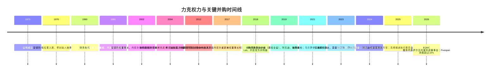
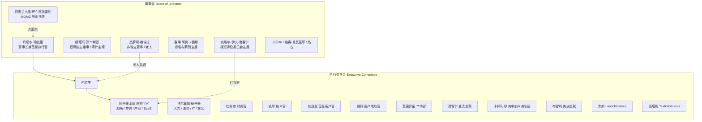
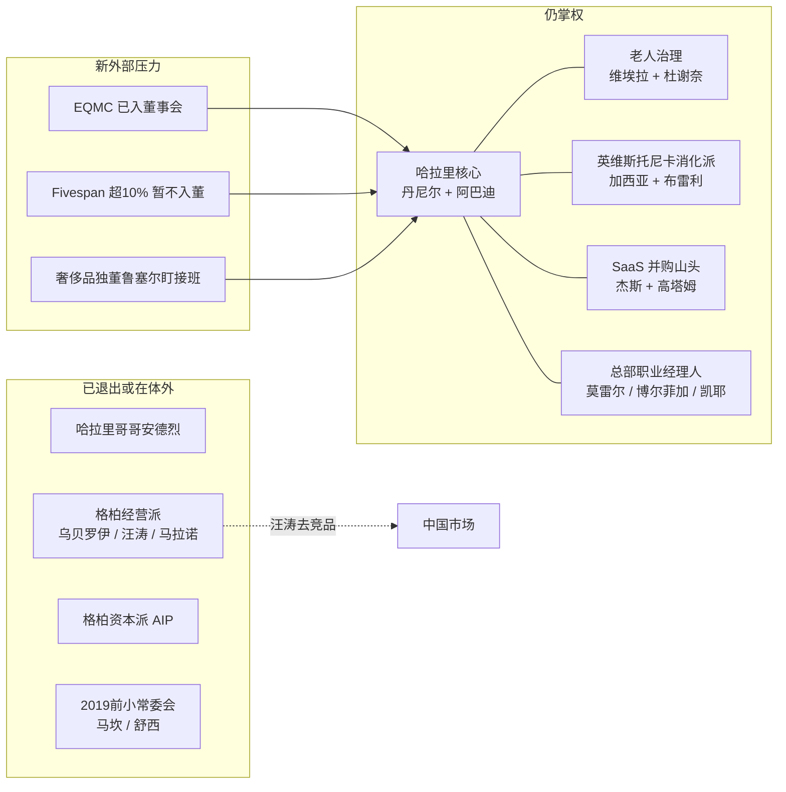

# 力克全球（Lectra）关键人物关系与派系研究报告

> 给业务决策者的一句话：  
> **力克今天不是“职业经理人公司”，而是一家正在做接班安排的创始人公司。** 真正的权力中心仍是董事长兼首席执行官丹尼尔·哈拉里（Daniel Harari）；他亲自带大的马克西米利安·阿巴迪（Maximilien Abadie）已被放到副首席执行官位置上。格柏（Gerber）被收购后，原来的美国/亚太班底基本已经离开，其中亚太前任汪涛去了直接竞品经纬数控（JWEI）。中国区现在的法定代表人是法国空降的亚太总裁莫雷尔（Frédéric Morel），但集团里最懂中国销售的人，其实是现任首席客户官哈维尔·加西亚（Javier Garcia）。

---

## 0. 先读这三页：你现在就能用的判断

### 0.1 谁说了算

| 问题 | 公开事实 | 业务含义 |
|---|---|---|
| 公司一把手是谁 | 丹尼尔·哈拉里，1991 年起主导，现任董事长兼首席执行官 | 重大合作、价格、并购、中国政策，最终仍会到他或他指定的人 |
| 他身边最像接班人的是谁 | 阿巴迪：2012 年以“首席执行官项目经理”身份加入，2025 年 7 月任副首席执行官。2015 年哈拉里还公开说过“不想考虑接班”；现在董事会已设接班委员会，但仍**没有**宣布指定接班人 | 谈战略、SaaS（软件按年订阅，而不是一次买断）、并购，优先找他；重大拍板仍默认哈拉里 |
| 老人还在不在 | 前常务副总裁维埃拉（Jérôme Viala）干了 38 年，2024 年退休后进董事会，并进入“首席执行官接班特设委员会” | 老人没有消失，而是退到董事会盯着交接 |
| 钱在谁手里 | 到 2026 年 6 月 30 日：哈拉里、西班牙基金 EQMC、美国基金 Fivespan **三家都超过 10%**；另有法国 Amiral、美国 Brown Capital、荷兰 Kempen 各超过 5%。公司自己回购后库存股约 2.2% | 接班期是“创始人 + 两家超 10% 机构 + 三家 5% 以上机构”的多方博弈；Fivespan 声明暂不入董，但写了“情况大变可再考虑” |
| 董事会有没有顶过他 | 2025 年 2 月，首席独立董事罗斯·麦金尼斯因“首席独立董事该管什么”与哈拉里意见不合辞职 | 制衡不是摆设，但硬刚的人走了，换成风格更软的私人银行背景独董 |

### 0.2 这家公司真正的“人脉断层”在哪里

公开人事轨迹显示，力克内部至少有 **五层叠在一起的人**，不是一个单纯的法国总部：

1. **哈拉里核心 / 接班线**：哈拉里 → 阿巴迪  
2. **力克老人治理线**：维埃拉 → 现任财务官杜谢奈（Olivier du Chesnay）  
3. **2004 年英维斯托尼卡（Investronica）吸收派**：加西亚、布雷利（John Brearley）——已经完全力克化  
4. **2021 年格柏派**：几乎被清出决策层（汪涛、马拉诺、乌贝罗伊、格柏财务官吉布斯、AIP 董事均已离开）  
5. **新并购山头**：Launchmetrics 的杰斯（Michael Jaïs）、TextileGenesis 的高塔姆（Amit Gautam）——品牌仍相对独立，创始人进了执行委员会

### 0.3 对中国业务最重要的三件事

1. **亚太总裁换人，不是普通人事调整。** 2023 年 9 月，格柏出身的汪涛被替换为法国瓦卢瑞克（Vallourec，做钢管的工业集团）空降的莫雷尔。上海公司工商登记的法定代表人现为莫雷尔。  
2. **汪涛去了经纬数控当总裁。** 这是裁床/数控切割赛道的直接竞品。他带走的不只是履历，还可能是客户关系和原格柏亚太团队的信任。  
3. **集团里最懂中国的人现在不在上海一把手位置上。** 加西亚（中文公开稿作 **贾必威**）2000 年起就在中国做英维斯托尼卡，2004 随并购入力克，当过大中华销售副总裁、亚太总裁，现在是总部首席客户官。  
4. **中国汽车线是力克自己的堡垒，家具线更像格柏战场。** 杰里米·朱（Jeremy Zhu）从 1996 年就在力克做汽车，几乎没被格柏人事冲掉；家具航空销售总监克里斯·肖（Chris Xiao）则是格柏带来的人，2023 年 9 月和汪涛同一波离开，去了经纬。  
5. **2009–2018 年，大中华董事总经理安德烈亚斯·金（Andreas A. Kim）是直接向哈拉里汇报的。** 那以后公司不再对外设“中国区总经理”，改由亚太总裁管中国。  
6. **中国一线不是“只听上海法国总裁”。** 软件客户服务经理 Jason Huang 公开写：重大技术问题每周向**亚太总裁和法国总部**汇报；耗材南区负责人谭子鹏（做到 2025 年 6 月）公开写：业绩和价格策略直接跟法国总部谈。行政上听莫雷尔，价钱和技术上仍有一条线通巴黎。

---

## 1. 研究范围、方法与诚实边界

### 1.1 这家公司是谁

**Lectra（力克）** 是法国上市公司（股票代码 LSS），给时尚、汽车座椅、家具行业卖三样东西：设计/排料软件、自动裁床、以及越来越多的订阅制软件服务。1973 年成立，1990 年差点破产，被哈拉里兄弟重组后活到今天。2021 年它买下了几十年的老对手、美国 **格柏科技（Gerber Technology）**。中国主体常见名称是 **力克系统（上海）有限公司**，地址在上海徐汇钦州北路。

### 1.2 信息怎么来的

本次研究只使用公开信息，按“一手优先”排序：

1. 力克投资者关系官网：董事会、执行委员会个人简历页  
2. 公司新闻稿、股东大会文件、2024 年年报（Universal Registration Document / Annual Financial Report）  
3. 中国工商/企业库对上海公司法定代表人的登记  
4. 领英（LinkedIn，职场简历社交网站）**公开可见**的职位时间线和离职帖  
5. 行业媒体：FashionNetwork、WWD、Textile World、Home News Now、纺织服装周刊、经纬数控官网  
6. 股东披露：MarketScreener、AMF 阈值公告转述  

### 1.3 这次做不到、必须写明的限制

- **领英完整评论、私信、共同好友、内部推荐信**，没有登录账号无法系统抓取。下面用到的领英内容，都是搜索引擎和公开帖能看到的部分。  
- **脉脉需登录，看准网已于 2024 年 9 月关停**，中国区中文匿名长评基本抓不到。Glassdoor / Indeed / Comparably 能看到的，大多是欧美员工在骂巴黎总部，不能直接当成上海办公室的日常。  
- **中国区中层没有官方组织图。** 下面名单来自领英公开履历和工商转载交叉，不是公司授权花名册。汉字名多数未公开证实。  
- **“派系”不是公司自己承认的组织。** 下文凡写“派”，都是根据：谁提拔谁、谁一起经历过哪次并购、谁后来离开去了竞品——这三类公开轨迹做的聚类。它能帮助你判断“跟谁谈、谁能拍板、谁已经离心”，但不能当成法庭证据。

### 1.4 置信度怎么读

- **高**：官网简历、新闻稿、年报、工商登记互相印证  
- **中**：领英公开职位时间线、可靠行业媒体对当事人自述的报道  
- **低**：单一二手转述、或从轨迹做的关系推断

---

## 2. 权力是怎么换代的：一条 50 年的人线

把人物关系看懂，先把公司当成“谁接管过它”来看。

### 2.1 哈拉里兄弟：从救援者到“丹尼尔一个人的公司”

**事实（高）：**

- 1990 年危机后，安德烈·哈拉里（André Harari）和丹尼尔通过他们的投资公司 Compagnie Financière du Scribe 重组力克。  
- 1991 年丹尼尔成为董事长兼首席执行官。  
- 2002 年起两职分开：安德烈当董事长，丹尼尔当首席执行官。这是法国上市公司常见的“哥哥管治理、弟弟管经营”。  
- 2017 年 6 月，安德烈把约 16.6% 股份（520 万股）以每股 24 欧元全部卖给机构，7 月 27 日辞去董事长和董事。丹尼尔保留当时约 17.5% 的持股，并重新把董事长和首席执行官两职并到自己身上。  
- 丹尼尔公开履历写得很清楚：他在公司外**不担任任何其他董事职务**。这意味着他的职业身份几乎等于力克本身。

**推断（中）：**  
2017 年不是“兄弟反目”，而是一次设计好的股权社会化：安德烈套现离场，丹尼尔留下继续当老板，同时把股票流通盘做大，方便机构进入。从那一年开始，力克从“两兄弟控股的家族公司”变成“一个创始人老板 + 机构股东”的结构。2024 年年报自己写：对投资者和员工来说，**哈拉里的名字已经和力克分不开**。

### 2.2 2017–2019：把“4.0 战略”和组织绑在阿巴迪身上

**事实（高）：**

- 2017 年公司启动“力克 4.0 战略”。  
- 阿巴迪 2012 年 1 月加入，职务是 **Project Manager to the Chief Executive Officer**，直译就是“首席执行官的项目经理”，也就是哈拉里办公室的人。  
- 之后路径非常陡：2013 战略规划分析师 → 2016 战略总监 → 2019 年 1 月进执行委员会任首席战略官 → 2022 年兼首席产品官 → 2025 年 7 月副首席执行官。  
- 2019 年 1 月 15 日执行委员会**扩编，不是清洗**：原 5 人（哈拉里、舒西 Céline Choussy、马坎 Edouard Macquin、维埃拉、佐科莱托 Véronique Zoccoletto）全部留任；新进阿巴迪、雅科、杜谢奈、加西亚、马克斯-朗、卡纳利。  
- 2022 年 1 月 1 日再扩到约 16 人，官方目标写明是“完成格柏与力克团队整合”。格柏这边上来的是吉布斯（副财务官）、马拉诺（美洲）、汪涛（亚太）。

**推断（高）：**  
阿巴迪不是“空降空降的空降”，他是哈拉里从 30 岁左右开始带的人。官方只点名他主导 TextileGenesis、Launchmetrics 和两笔少数股权；更早的大交易公开发言人仍是哈拉里。2025 年哈拉里亲口说：阿巴迪在 4.0 战略里起了关键作用，现在要准备 2026–2028 下一段战略。这就是公开场合能给出的最强“接班信号”，但**不是指定接班人公告**。

### 2.3 2021 年后：买下对手，再慢慢换掉对手的人

**事实（高）：**

- 2021 年 6 月 1 日完成收购格柏：现金约 1.75 亿欧元 + 新发 500 万股给卖方 AIP（美国工业合伙人基金）。交易后哈拉里约 14.6%，AIP 约 13.3%。  
- 格柏首席执行官莫希特·乌贝罗伊（Mohit Uberoi）只担任哈拉里的特别顾问到 2021 年底，之后未进入长期执行委员会。  
- AIP 派出的董事让-马里·卡南（Jean-Marie Canan）2021 年 6 月上车，**2024 年 4 月 24 日辞职**。卡南本人是普华永道/默克履历的外部董事，**不是 AIP 执行合伙人**。  
- 2024 年 2 月 21 日，AIP 持股已降到约 3.82%，低于 5%（其中约 150 万股私募约 4500 万欧元）。**2024 年 6 月 4 日前公司获悉其已卖光全部持股。** 现任 9 人董事会没有 AIP 代表。  
- 亚太：汪涛（Edward Wang，格柏亚太总经理，并购后留任）2023 年 9 月被莫雷尔替换。  
- 美洲：格柏原首席商务官伦纳德·马拉诺（Leonard Marano）2021–2025 年任美洲总裁，2025 年 9 月离开，由力克老人布雷利接任。

**推断（高）：**  
力克对格柏的整合策略很清楚：**先留用区域一把手保证客户不断档，再在 2–4 年内换成自己体系的人。** 格柏没有在集团决策层留下长期山头。这和 Launchmetrics、TextileGenesis“创始人进执行委员会、品牌继续独立运营”完全不同。

---

## 3. 现任权力地图

### 3.1 今天的决策结构（公开职务，不是内部汇报线）

说明：箭头是根据公开职务和任命新闻做的**管理关系推断**。公司没有公布一张内部组织架构图上的实线汇报。

### 3.2 董事会：9 个人，其实是 4 种背景

现任 9 名董事（官网，2026 年股东会后）：4 女 5 男，其中 6 人被认定为独立董事。

| 姓名 | 角色 | 背景聚类 | 与力克的旧关系 | 置信度 |
|---|---|---|---|---|
| 丹尼尔·哈拉里 | 董事长兼首席执行官、战略委员会主席 | 创始人控制人 | 1991 年至今 | 高 |
| 热罗姆·维埃拉 | 非独立董事；战略/审计/薪酬/接班委员会 | 内部老人 | 1985 年入职，38 年，2024 年 3 月退休、4 月进董事会 | 高 |
| 菲奥兰杰洛·萨尔瓦托雷利 | 非独立董事；战略、人工智能委员会 | 机构股东代表 | EQMC 提名，EQMC 持股超过 10% | 高 |
| 娜塔莉·罗辛斯基 | 首席独立董事、审计主席 | 私人银行 / 家族办公室 | 高盛、隆奥（Lombard Odier）；2016 年起任董事，2025 年 4 月起首席独董 | 高 |
| 塞琳·阿贝卡西斯-莫埃达斯 | 提名与薪酬主席，也在接班委员会 | 学术 + 时尚科技 | **1999 年曾在力克做电子商务产品经理**；2014–2020 年与力克合办 ESCP“时尚与科技”教席 | 高 |
| 皮埃尔-伊夫·鲁塞尔 | 接班特设委员会主席 | 奢侈品客户侧 | 前 LVMH 时装集团董事长兼首席执行官，现 Tory Burch 首席执行官 | 高 |
| 卡琳·卡尔韦 | 人工智能委员会主席 | 工业软件 / 数字化 | CGI、凯捷、阿尔卡特、威瑞森、微软、施耐德-AVEVA | 高 |
| 埃莱娜·维奥-普瓦里耶 | 可持续发展委员会主席 | 时尚零售经营 | 曾在 Orange、Vivarte，现任 Chevignon 董事长兼首席执行官 | 中 |
| 克里斯托夫·热古 | 审计、战略、人工智能委员会 | 法国精英技术官僚 / 产业投资 | 综合理工、财政部、原子能委员会、Meridiam、Yotta；与哈拉里同样出身综合理工 | 高 |

**必须单独说的三个人：**

1. **维埃拉不是“普通外部董事”。** 他 1985 年进财务部，1994–2016 年当集团财务官，2016 年升常务副总裁，2024 年 3 月 31 日退休。哈拉里在股东会上说“带着特别的感情欢迎他”。年报董事持股表里，他个人持有约 **12.09 万股**（检索自 2024 年年报董事信息表），是除哈拉里外董事里最显眼的内部持股人。他同时进入接班特设委员会。  
   **推断：** 他是哈拉里交给董事会的“老人监督者”，用来保证接班不断档、文化不被机构股东改掉。

2. **阿贝卡西斯被正式标成“独立董事”，但她不是路人。** 她 1999 年在力克工作过，后来长期做法国商学院与力克的联合教席。她还主持提名委员会和薪酬委员会，并进入接班委员会。  
   **推断：** 在法国治理规则下她可以算独立（已离开公司超过 5 年），但人情上她属于“懂力克、也不会故意拆力克”的自己人。

3. **鲁塞尔是客户世界的人，不是供应商世界的人。** 他管过 LV 集团里的 Celine、Givenchy、Kenzo 等，现在管 Tory Burch。让他当接班委员会主席，信号是：后哈拉里时代，董事会希望下一位老板能被奢侈品/时尚客户认账，而不只是会卖裁床。

### 3.3 执行委员会：13 人，可以分成 5 组

#### A组 · 哈拉里核心 / 接班线

**丹尼尔·哈拉里**  
- 综合理工（École Polytechnique，法国最硬的理工精英学校）+ HEC 商学院。  
- 1980–1983 资产管理机构 Meeschaert；1984–1990 自己办电脑分销公司；1986 年起和哥哥一起做科技风险投资。  
- 1991 年接管力克至今。71 岁左右。持股约 12.75%（MarketScreener / 年报口径 12.7%）。2024 年 2 月卖过 70 万股还旧贷款，并声明短期内不打算再卖。  
- 年报原话大意：他的名字对投资者和员工已与力克不可分割；执行委员会里那些“体现力克基因超过 20 年”的关键人物如果离开，会构成接班风险。

**马克西米利安·阿巴迪（副首席执行官）**  
- 巴黎达芬、巴黎第二大学、意大利博科尼大学金融硕士。  
- 2012 年 1 月加入，**直接向首席执行官汇报**。  
- 官方职责：和哈拉里、执行委员会一起制定战略；负责对外并购与合作；管产品战略；2025 年 7 月起主抓集团 SaaS。  
- 集团自己的副首席执行官任命稿写：他 **主导（led）** 了 TextileGenesis 和 Launchmetrics。更早的格柏、Kubix、Retviews、Neteven、Gemini 公开发言人几乎都是哈拉里；土耳其渠道并购 Glengo 的发言人是维埃拉。所以能写成“他直接负责”的，主要是后两桩软件收购和 2024 年两笔少数股权（新加坡 Six Atomic、法国 AQC）。  
- **上下级事实：** 2012–至少 2019 年，他是哈拉里的直接下属。此后变成“并列核心，但仍是哈拉里任命并公开背书的人”。

#### B组 · 力克老人 / 内部晋升（设备与客户基因）

| 人 | 加入 | 关键轨迹 | 派系含义 |
|---|---|---|---|
| 洛朗丝·雅科 Laurence Jacquot | 2000 | 汉高采购 → 赛诺菲采购 → 力克采购副总裁 → 工业运营 → 裁床研发 → 2019 客户成功官 | 典型“工厂/设备老兵”，不是金融空降 |
| 哈维尔·加西亚 Javier Garcia | 2004（英维斯托尼卡 2000 年起在中国） | 英维斯托尼卡中国负责人 → 力克大中华销售副总裁 → 战略大客户 → 汽车全球销售 → 亚太总裁 → 首席客户官 | **集团里中国资历最深的现任高管** |
| 约翰·布雷利 John Brearley | 2004（英维斯托尼卡更早） | 英维斯托尼卡英国/北美 → 力克耗材配件 → 2007 美洲客户服务副总裁 → 2020 客户成功资深副总裁 → 2025.10 美洲总裁 | 英维斯托尼卡老人，接替格柏的马拉诺 |
| 奥利维耶·杜谢奈 Olivier du Chesnay | 2013 | 圣戈班、埃森哲、霍尼韦尔财务 → 力克副财务官 → 2017.9 接维埃拉任财务官 | 维埃拉亲手带的财务接班 |
| 安东内拉·卡佩利 Antonella Capelli | 2013 | IBM 时尚咨询 → 力克意大利专业服务 → 南欧销售 → 2024 接退休的卡纳利任欧洲中东非洲总裁 | 内部销售晋升，意大利时尚客户基因 |

**交叉关系（高）：**  
加西亚和布雷利都来自 **2004 年被力克买下的西班牙英维斯托尼卡**。这是比格柏更早、也更彻底被消化的一次并购。20 年后，这两人分别管“全球客户”和“美洲”，说明力克擅长把被收购公司里“愿意留下的销售/服务骨干”养成自己人。

杜谢奈 2013 年进来当维埃拉副手，2017 年维埃拉升常务副总裁时接财务官。这是标准的内部师徒交接。

#### C组 · 法国总部职业经理人空降（2017 年后补进来的职能）

| 人 | 加入执行委员会 | 上一份工作 | 为什么重要 |
|---|---|---|---|
| 蒂埃里·凯耶 Thierry Caye | 2021.7 | Tessi 技术高管，2020 年 4 月入力克任研发资深副总裁 | 软件/SaaS 基础设施出身，不是裁床老人 |
| 玛丽亚·莫德罗诺 Maria Modrono | 2021.7 | Sage、安联旗下欧爱科；2018 入力克，2021 接舒西任市场官 | 接替离开的老市场官 |
| 安娜·博尔菲加 Anne Borfiga | 2023.10 | 沃塔利亚（Voltalia）董事会秘书/变革；达芬校友 | 管人力、法务、IT、行政，并负责推行 **The Lectra Way（力克之道）** |
| 弗雷德里克·莫雷尔 Frédéric Morel | 2023.9 | 瓦卢瑞克东南亚太执行副总裁；圣戈班起步 | **行业外空降**，现任亚太总裁、上海公司法代 |

**推断（中高）：**  
莫雷尔和杜谢奈都在圣戈班待过，但时间差很大，不能据此说他们是一套班子。更有意义的是：莫雷尔来自钢管/能源工业，**不是时尚、不是裁床、不是格柏**。用他替换汪涛，像是总部要一个“听话的国际职业经理人”，而不是“在亚洲有自己客户网的本地强人”。

博尔菲加的任务写在新闻稿里：推行 The Lectra Way。官方人力资源政策说得很直白——这套文化就是为了 **把并购进来的团队收编进一个统一行为指南**。全球有约 90–140 名“文化大使”。

#### D组 · 新并购山头（被允许保留品牌和创始人）

**迈克尔·杰斯 Michael Jaïs（Launchmetrics 联合创始人兼首席执行官）**  
- 2024 年 1 月力克收购约 50.3%，其余股权计划分到 2030 年买完，总价约 2.0–2.4 亿美元。  
- 杰斯 2024 年 1 月 29 日进执行委员会，对外仍称 “CEO of Launchmetrics, a Lectra company”。  
- 前身是 Augure，做过汤姆逊、埃森哲；巴黎政治学院背景，人在法国。  
- 他自己接受采访时说：本来可以上市或跨行业，最后选择和力克绑定，继续深耕时尚美妆。

**阿米特·高塔姆 Amit Gautam（TextileGenesis 创始人兼首席执行官）**  
- 2022 年 12 月力克买下 51%，其余计划 2026、2028 年买。  
- 2025 年 7 月 1 日进执行委员会。哈拉里评价：他在整合中起了非常正面的作用。  
- 之前：麦肯锡、Booz、兰精（Lenzing）时尚业务全球副总裁。印度理工 + 卡内基梅隆。  
- 客户侧点名过 Kering、Zegna、H&M、Bestseller、On。

**推断（高）：**  
这两家和格柏待遇完全不同。原因也很实际：它们是 **SaaS 订阅收入** 的来源，2024 年年报写 Kubix Link、TextileGenesis、Launchmetrics 三家贡献了当年新增订阅的 65%。哈拉里需要它们的创始人继续打仗，所以给执行委员会席位，而不是换掉。

阿巴迪是把这些公司买进来的人，所以 D 组在组织上更靠近阿巴迪，而不是靠近维埃拉那种设备老人。

#### E组 · 已经离开决策层、但仍影响中国和美洲市场的人

见第 5 章。这里先记一句：格柏派的三个最重要的人——乌贝罗伊、汪涛、马拉诺——**现在都不在力克拿工资**。

### 3.4 谁拿着股票、2026 年股东大会投了什么

**股权（事实，高）：**

| 时点 | 谁 | 公开口径 | 来源 |
|---|---|---|---|
| 2024 年报披露 | 丹尼尔·哈拉里 | 4,807,560 股（约 12.7%） | 2024 年年报董事简历 |
| 2024 年报披露 | 热罗姆·维埃拉 | **120,931 股** | 同上 |
| 2024 年报披露 | 罗辛斯基 / 阿贝卡西斯 / 鲁塞尔 / 维奥-普瓦里耶 / 卡尔韦 | 各 1,500 / 750 / 701 / 311 / 253 股 | 同上；章程要求董事至少持 750 股，新董事可后补 |
| 2026-04 股东会材料 | 热古、萨尔瓦托雷利 | 当选时各 **0 股** | 2026 年董事会决议报告 |
| 2025-07-24 | EQMC（Alantra EQMC Asset Management，西班牙） | 向上越过 10% | 2025 全年财务信息 |
| 2025-09-24 | 富达 Fidelity | 向下跌破 5% | 同上 |
| 2025-12-22 | Fivespan Partners LP（旧金山，代 Fivespan Partners Fund） | 向上越过 5% | 同上 |
| 2026-02-24 / 03-02 | Fivespan | 越过 10%；持 4,289,620 股，**11.27%** | AMF 申报、MarketScreener / Boursier |
| 2026-06-30 | 哈拉里、EQMC、Fivespan | 三家都超过 10% | 2026 年半年报 |
| 2026-06-30 | Amiral Gestion、Brown Capital、Kempen | 各超过 5%、不到 10% | 同上 |
| 2025-12-31 | 管理层和关键员工期权 | 498 人持摊薄后约 4.4%；哈拉里**不拿期权** | 官网股权页（2025 年末口径） |
| 2026-06-30 | 公司库存股 | 846,608 股，约 **2.2%**（回购 818,206 股 + 流动性协议） | 2026 年半年报 |

**阿巴迪个人持股：** 年报不披露执行委员会成员的个人持股总数。能看到的只有内幕交易：他在 2024 年 1 月 2 日买入 10,296 股。维埃拉同一天买入 59,875 股，退休前 2024 年 3 月还行权并卖出一部分。**不能**据此算出阿巴迪现在一共有多少股。

**Fivespan 公开立场（事实）：** 在公开市场继续买；不打算控股；不打算自己或派人进董事会；但这句话后面跟了标准但书——“若公司情况和环境发生重大变化，可再考虑”。公开材料**未见**它给董事会的公开信，也**未见**它与 EQMC、哈拉里的联合声明。

**EQMC（事实）：** 萨尔瓦托雷利的董事候选人是 EQMC 正式提名的，职务是 Alantra EQMC 基金董事总经理。2026 年 4 月 29 日股东会第 9 项以 **99.80%** 通过，几乎没有反对。他进战略委员会，标为非独立董事。

**2026 年 4 月 29 日股东大会（事实）：**

- 出席率 90.688%，417 名股东。哈拉里主持；维埃拉当监票人之一；博尔菲加当秘书。  
- 萨尔瓦托雷利、热古都以约 99.8% 通过。  
- 哈拉里 2025 年薪酬方案反对票 3.10%，是“对人”的议案里相对高的，但仍轻松通过。  
- **第 16 项（授权董事会发股票期权）反对 7.74%**，是通过议案里反对最多的。  
- **第 17 项（给员工储蓄计划增发股票、取消优先认购权）被否决：反对 75.85%。** 公司想扩大员工持股，机构股东不让稀释。

**股价背景（事实，用来理解股东心情）：** 2026 年上半年股价从 2025 年末 25.50 欧元跌到 6 月 30 日 17.16 欧元，跌约 33%；公司同时启动最多 5000 万欧元回购，首期 2000 万欧元，到 6 月底已花 1360 万欧元。

**推断（中）：** Fivespan 和 EQMC 目前是“友善大股东”姿态：EQMC 已经要到一个董事席位，Fivespan 先屯股、把入董权留在口袋里。第 17 项被大比例否决，说明机构要的是利润和股本不被摊薄，不是“全员持股文化”。接班如果拖、或者股价继续弱，Fivespan 那句但书就会变实。

---

## 4. 同公司、同行业、上下级：交叉关系总表

下面这张表是本次研究最有用的部分。只写能被公开履历支撑的交叉，不写“可能认识”。

| 人物 A | 人物 B | 关系类型 | 时间 | 证据 | 业务含义 |
|---|---|---|---|---|---|
| 安德烈·哈拉里 | 丹尼尔·哈拉里 | 兄弟；共同控股 Scribe；1991–2017 共同管理 | 1976–2017 | 官网、2017 年新闻稿 | 家族起源；安德烈已退出 |
| 丹尼尔·哈拉里 | 马克西米利安·阿巴迪 | 直接上下级 → 指定副手 | 2012 至今 | 官网：“Project Manager to the CEO” | 最清晰的接班线 |
| 丹尼尔·哈拉里 | 热罗姆·维埃拉 | 老板与 38 年财务/运营搭档 | 1985–2024，此后董事 | 官网、2024 年董事任命稿 | 老人退到董事会盯交接 |
| 热罗姆·维埃拉 | 奥利维耶·杜谢奈 | 财务师徒：副手接正职 | 2013–2017 | 官网双方简历 | 财务体系连续 |
| 哈维尔·加西亚 | 约翰·布雷利 | 同一被收购公司（英维斯托尼卡） | 2004 并购 | 双方官网简历 | 老并购派，已完全力克化 |
| 哈维尔·加西亚 | 中国区业务 | 2000 年起中国一线 | 2000–约 2019 亚太 | 官网 | 现任高管里中国资历最深 |
| 爱德华·汪涛 | 莫希特·乌贝罗伊 | 格柏体系上下级（区域总 vs 集团首席执行官） | 2018–2021 | 汪涛领英：Gerber/Lectra APAC | 格柏亚太班底 |
| 爱德华·汪涛 | 弗雷德里克·莫雷尔 | 前后任亚太总裁 | 2023.9 | 力克新闻稿 | 格柏本地派被法国空降替换 |
| 伦纳德·马拉诺 | 约翰·布雷利 | 前后任美洲总裁 | 2025.9–10 | 力克新闻稿、Home News Now | 格柏美洲派被力克老人替换 |
| 伦纳德·马拉诺 | 莫希特·乌贝罗伊 | 格柏同事（商务 vs 首席执行官） | 约 2014–2021 | 马拉诺履历 | 格柏总部商业班底 |
| 阿巴迪 | 杰斯 / 高塔姆 | 并购对接人与被收购创始人 | 2022–2024 | FashionNetwork、收购新闻稿 | 新 SaaS 山头的“娘家人”是阿巴迪 |
| 法比奥·卡纳利 | 安东内拉·卡佩利 | 南欧上下级 → 退休交接 | 约 2013–2024 | 2024 年任命稿 | 意大利班底内部交接 |
| 塞琳·舒西 | 玛丽亚·莫德罗诺 | 前后任市场官 | 2021 | 双方履历 | 老市场线被替换 |
| 塞琳·阿贝卡西斯 | 力克本身 | 前员工 + 联合教席 | 1999；2014–2020 | 官网董事页 | “独董”里最懂力克的人 |
| 皮埃尔-伊夫·鲁塞尔 | 塞琳·阿贝卡西斯 | 同事董事；她公开称 “board colleague” | 2023 至今 | 领英公开动态 | 接班委员会内部有公开互动 |
| 克里斯托夫·热古 | 丹尼尔·哈拉里 | 同校（综合理工） | 教育背景 | 双方官网 | 精英圈层亲近，不是同事关系 |
| 萨尔瓦托雷利 | EQMC 基金 | 基金高管被派进董事会 | 2026.4 | 股东大会文件 | 大股东第一次正式坐进董事会 |
| 让-马里·卡南 | AIP / 格柏卖方 | 并购后派出董事，2024 年离任 | 2021–2024 | 新闻稿、股东大会手册 | 格柏资本派已退出 |
| 爱德华·汪涛 | 经纬数控 | 离任后任总裁 | 约 2023 末至今 | 经纬官网“领导风采” | 客户关系和团队存在被挖走的风险 |
| Jason Huang | 莫雷尔 / 法国总部 | 双重汇报：亚太总裁 + 总部 | 2020 起本职 | 其领英职务描述 | 中国软件服务不是上海一人说了算 |
| 谭子鹏 | 法国总部 | 耗材业绩与价格直连总部 | 2014–2025.6 | 其领英职务描述 | 南区耗材利润岗；2025-06 已离开 |

### 4.1 领英公开帖里能看到的“人情温度”

这些是公开帖，不是分析臆造：

1. **爱德华·马坎（Edouard Macquin）2022 年 1 月离职帖**（他当时是美洲总裁，在力克从 1990 年代做到 2022 年）：  
   > “Special thanks to Daniel Harari, Lectra’s CEO, a mentor, a coach, and a friend.”  
   中文大意：特别感谢丹尼尔·哈拉里，他是导师、教练，也是朋友。  
   **含义：** 老人对哈拉里的情感是师徒式的，不是冷冰冰的雇佣。这种文化会让“不站队哈拉里的人”很难在核心层待久。

2. **伦纳德·马拉诺 2025 年 9 月 19 日最后一天帖：**  
   > “After 11 years combined between Lectra and Gerber, today is my last with the company.”  
   中文大意：在力克和格柏合计 11 年后，今天是我在公司的最后一天。  
   他写到有很好的导师、同事变成朋友，为把力克带到“新的体量”感到骄傲。语气体面，没有公开抱怨。随后去了标识/图文材料行业的 M2S Group。

3. **迈克尔·杰斯 2024 年 1 月收购宣布帖：** 使用 “Lectra family（力克大家庭）” 这种家族话语。这和哈拉里体系一贯的修辞一致。

4. **汪涛** 离开后在经纬数控公开活动中，用“老朋友、喝酒、展会”经营原行业圈。这是销售型领导人的典型再出发，不是隐退。

---

## 5. 离任人物：谁走了、去了哪、还算不算一股力量

### 5.1 家族第一代退出

**安德烈·哈拉里**  
- 1976 年入股，1991–2017 年与弟弟共同管理，2002–2017 年董事长。  
- 2017 年清仓离场。此后公开治理文件中不再作为决策人出现。  
- **现状判断（高）：** 家族经营已收束为丹尼尔一个人。没有证据显示安德烈还在幕后管日常。

### 5.2 2019 年之前的五人小常委会，现在只剩哈拉里

| 人 | 当时职务 | 离开时间 | 去向 | 与哈拉里关系 |
|---|---|---|---|---|
| 热罗姆·维埃拉 | 常务副总裁、执行委员会副主席 | 2024.3 退休，转董事 | 董事会 + 接班委员会 | 最深老人，仍在 |
| 爱德华·马坎 | 销售总管 / 美洲总裁 | 2022.1 | 自办 OpUp Consulting | 公开称哈拉里是导师和朋友 |
| 塞琳·舒西 | 市场官 → 产品与创新官 | 2022.11 | Septeo，后 OVHcloud 市场官 | 达索系统、欧特克出身的外部职业经理人 |
| 韦罗妮克·佐科莱托 | 首席转型官 | 2022 年 1 月的 16 人名单中已消失 | 公开材料未见官方离职稿 | 2011 年转型计划核心 |

**推断：** 2019 年扩编执行委员会，表面是“让组织现代化”，实际效果是：老的五人小圈子被摊薄，阿巴迪和一批 40–50 岁的业务负责人进入核心。舒西 2022 年离开后，产品权逐步收到阿巴迪手里（2022 年他加了首席产品官头衔）。

**关于佐科莱托去向（推断，单独标出）：** 领英上 Véronique Villiers-Moriamé 的职务链与佐科莱托完全吻合（人力/信息官 → 首席转型官 2016–2020 → 首席数字官至 2021-10，均为执行委员会成员），之后任希腊酒庄董事长。官方未发“改姓/离职”新闻稿，因此“她改姓并于 2021 年 10 月离开”只能作高度吻合的推断，不能当已证实法律事实。

### 5.3 格柏体系：进得快，出得也快

| 人 | 格柏职务 | 力克职务 | 离开 | 去向 |
|---|---|---|---|---|
| 莫希特·乌贝罗伊 | 格柏首席执行官（2017–2021） | 哈拉里特别顾问到 2021 年底 | 2021 末 | EMT International 股东兼首席执行官（印刷包装设备） |
| 爱德华·汪涛 / 王涛 | 格柏亚太总经理（2018 起） | 力克亚太总裁至 2023.9 | 2023.9 | **经纬数控 CEO / 总裁** |
| 伦纳德·马拉诺 | 格柏首席商务官 | 力克美洲总裁 2021.6–2025.9 | 2025.9 | M2S Group 首席商务官 |
| 卡伦·吉布斯 Karen Gibbs | 格柏财务官（约 20 年） | 力克副财务官并进执行委员会 | 2024.1 | Mastercam 财务官 |
| 克里斯·肖 Chris Xiao | 格柏华北/工业销售总监 | 力克大中华家具与航空销售总监 2021.7–2023.9 | 2023.9 | **经纬包装广告事业部总经理**（与汪涛同一波） |
| 让-马里·卡南 | AIP 方面董事 | 力克董事 2021.6–2024.4 | 2024.4 | 未再任职 |
| AIP 基金 | 格柏 100% 股东 | 一度持股约 13.3% | 2024.2 低于 5%；**2024.6 前卖光** | 资本退出，董事会已无代表 |

汪涛（经纬官网写“汪涛”）补充履历（经纬官网 + 领英，中）：复旦经济本科；丹纳赫旗下艾司科（Esko）大中华总经理；Lapp 电缆销售副总裁；2018 年人格柏亚太。这是标准的“外企在华职业经理人 + 裁切设备圈”履历，客户网和力克高度重叠。

**推断（高）：**  
格柏没有在力克形成可持久的内部派系。它留下的是产品品牌（AccuMark、裁床型号）和一部分美国/中国员工，不是决策权。对你做中国市场的含义是：很多老格柏客户的“熟人”可能已经不在力克，而在经纬或别的地方。

### 5.4 区域老人正常退休

- **法比奥·卡纳利 Fabio Canali**：约 20 年力克，意大利 → 南欧北非 → 欧洲中东非洲总裁，2024 年退休，卡佩利接任。属于正常交接。  
- **霍尔格·马克斯-朗 Holger Max-Lang**：2002 年起在力克德国体系，2019–2024 年任北欧/东欧/中东/南非总裁并进执行委员会。2024 年区域合并为统一的 EMEA 后，这个席位消失。领英显示他做到 2024 年 1 月。  
- **罗斯·麦金尼斯 Ross McInnes**：前首席独立董事。2025 年 2 月 12 日公司新闻稿原文写：他因与董事长兼首席执行官在 **首席独立董事职责范围** 上意见不合而辞职，2025 年 4 月 24 日生效。这是现任治理里唯一一次公开的“独董硬刚老板”。他此前做过赛峰（Safran）董事长、时任开云前身 PPR 的财务与战略执行副总裁，是董事会里分量最重的蓝筹治理独董。接任的罗辛斯基来自私人银行，制衡风格可能更软。公开文件没有再写分歧细节（例如是否要拆分董事长和首席执行官、接班节奏）。

### 5.5 2018 年以来官方并购全表（控股/资产 + 少数股权）

立克自己的口径是：2018 年以来约 **9 次收购 + 2 次战略合作**。2017 年公开材料只见“力克 4.0 战略启动”，**未见并购**。拆开后如下。用户有时点名的 **Nexio Solutions 不在官方名单中**，也未检索到收购新闻稿或年报记载，不能列入。

| # | 对象 | 时间 | 性质与对价（官方） | 创始人/负责人 | 收购后去向 | 官方是否点名阿巴迪 |
|---|---|---|---|---|---|---|
| 1 | Kubix Lab（意大利） | 签约 2018-01-25 | 100%；最高约 700 万欧元 | Giampaolo Urbani（CEO）、Pierluigi Beato（研发） | 品牌 Kubix Link 保留，Urbani 曾以产品经理对外发言；**未进执行委员会** | 否，发言人是哈拉里 |
| 2 | Retviews（比利时） | 签约 2019-07-15 | 先买 70%、800 万欧元；余下按收入倍数三年买完 | Loïc Winckelmans（联合创始人兼 CEO）、Lorenzo Pellizzari | 品牌保留，现为时尚产品线；创始人未进执行委员会 | 否 |
| 3 | 格柏科技 Gerber（美国，最大） | 交割 2021-06-01 | 无现金无负债 1.75 亿欧元 + 向 AIP 新发 500 万股，约合当时 3 亿欧元 | 卖方 AIP；经营层乌贝罗伊 | 全面整合；乌贝罗伊只当顾问到 2021 年底 | 否，对接的是哈拉里 |
| 4 | Neteven（法国） | 签约 2021-06-24 | 先买约 80%、1260 万欧元；**2025 年 9 月再付 330 万欧元，已 100% 持股** | Greg Zemor（CEO 兼联合创始人） | 品牌仍出现在 2026 年 SaaS 组合图；未进执行委员会。现职公开材料未见 | 否 |
| 5 | Gemini CAD（罗马尼亚） | 签约 2021-09-06 | 先买 60%、760 万欧元；总计约 1300–2000 万欧元 | Traian Luca（创始人兼 CEO） | 领英仍写 GEMINI CAD SYSTEMS CEO（a Lectra company）。罗马尼亚公开登记：力克约 **91.66%**，Luca 余约 6.06% | 否 |
| 6 | Glengo Teknoloji（土耳其） | 2022-04-25 | **业务资产**约 400 万欧元 + 新实体 25% 股权；**2025 年 6 月再付 170 万欧元，新实体已 100% 持股** | Mehmet Aykut Vural | 新实体 Glengo Lectra Teknoloji，Vural 任董事长兼 CEO；渠道合并 | 否，发言人是维埃拉 |
| 7 | TextileGenesis | 签约 2022-12 / 交割 2023-01 | 先买 51%、1520 万欧元；余下拟 2026、2028 | Amit Gautam | 继续任 CEO，**2025-07-01 进执行委员会** | **是，led** |
| 8 | Launchmetrics | 签约 2024-01-09 | 先买约 50.3%、约 8500 万美元；余下 2025–2030；总价约 2.00–2.40 亿美元。**2025 年 6 月再付 2380 万美元，持股升至 63.2%** | Michael Jaïs（CEO）；Eddie Mullon（联合创始人，Fashion GPS） | 杰斯 2024-01-29 进执行委员会；Mullon **未见进入**。2024 年报单独披露其收入 4120 万欧元 | **是，led** |
| 合作 | Six Atomic（新加坡） | 2024-09 | 约 18%、增资 250 万美元 | Taime Koe、Marc Close | 少数股权，可逐步增持；未进执行委员会 | 是，阿巴迪出面 |
| 合作 | AQC（法国） | 2024-10 | 约 30%、130 万欧元 | Pierre Magrangeas、Christian Bracich | 少数股权，人工智能质检；未进执行委员会 | 是，与 Six Atomic 并列 |

**进入现任执行委员会的被收购方创始人只有两位：杰斯、高塔姆。** 现任 13 人执行委员会里，**没有人来自格柏**。

**推断：** 力克的并购分成两档，不要混着看。  
- **设备/传统 CAD 对手**（格柏、Gemini，以及 Kubix/Retviews/Neteven 这类被产品化的小软件）：要技术、要客户、品牌可以留，但创始人一般不进集团决策层。格柏是全面整合；Gemini 仍相对独立运营子公司。  
- **新 SaaS**（Launchmetrics、TextileGenesis）：控股 + 分期买剩余股权 + 保留品牌/CEO + 创始人进执行委员会。2024 年报又写 Launchmetrics“团队、流程、产品整合已见成效”，所以应理解为**运营品牌独立 + 集团 SaaS 治理加强**，不是防火墙式不管。

---

## 6. 派系地图（分析，不是公司编制）

下面这张图是研究结论，不是组织架构图。

### 6.1 各派今天的力量对比

| 派系 | 现在还有没有权 | 特征 | 对你做事的影响 |
|---|---|---|---|
| 哈拉里-阿巴迪 | 最强 | 战略、并购、SaaS、接班 | 谈集团级合作、投资、产品路线，走这条线 |
| 老人治理 | 强，但在董事会 | 财务纪律、子公司管控、文化连续性 | 合同、付款、治理、长期信誉，维埃拉/财务线仍关键 |
| 英维斯托尼卡消化派 | 中强，在经营层 | 懂客户、懂中国和美洲服务 | 谈落地、谈客户成功、谈中国老客户，找加西亚比找莫雷尔更对口 |
| SaaS 并购山头 | 中，相对独立 | 时尚营销数据和溯源 | 谈品牌营销、可持续溯源，直接找杰斯/高塔姆，不必先过裁床体系 |
| 总部空降职业经理人 | 中，执行层 | 听话、跨行业、推行统一文化 | 亚太行政和法人事项找莫雷尔；别指望他有汪涛那种本地江湖 |
| 格柏经营派 | 体外 | 人走了，客户关系可能还在 | 中国和美洲老格柏客户，要核实对接人是不是已经跳槽 |
| 机构股东 | 变强 | EQMC 已入董；Fivespan 声明暂不入董，但写了“情况变化可再考虑” | 接班期他们会要利润、要 SaaS 故事、要治理规范化 |

### 6.2 有没有“法国总部 vs 美国格柏”的文化战争？

**公开事实能支撑的部分：**

- 格柏首席执行官没有留下。  
- 格柏亚太和美洲一把手都在 2–4 年内被替换。  
- AIP 董事和股份都退出了。  
- 官方文化工程 The Lectra Way 的明文目标之一，就是“把过去和未来的并购团队整合进集团”。  
- 2024 年年报写研发 707 人：法国 359、罗马尼亚 128、美国 60、印度 33、中国 21、意大利 20。美国研发体量已经明显小于法国，也小于罗马尼亚（Gemini 体系）。

**不能当成已证实的部分：**  
欧美匿名评论能支撑“法国总部 vs 非法国员工”的摩擦，以及法国本土也有人骂“政治斗争”；**不能**据此断言“美国团队普遍仇视巴黎”或“中国格柏销售集体离心”。人事结果看起来像一场以巴黎为中心的收编。格柏 Indeed 上更多人怀念乔·格柏（Joe Gerber）去世后走下坡，**少见点名“被力克买了之后更糟”**。

---

## 7. 和人有关的文化：这家公司到底像什么

把官方说法和人事行为对照着看，文化会清楚很多。

### 7.1 官方想让你相信的文化

力克对外三句口号：open-minded thinkers（开放思考的人）、trusted partners（被信任的伙伴）、passionate innovators（有热情的创新者）。

2023 年起加了一套内部操作系统，叫 **The Lectra Way（力克之道）**。秘书长博尔菲加负责推行。官方文件原意是：

- 并购和向 SaaS 转型会把人拆散，所以必须先统一文化；  
- 文化不是海报，而是行为指南，要嵌进招聘、晋升、人力资源流程；  
- 全球设文化大使（2024 年约 90 人，后来官网写到约 140 人）。

年报还写：集团没有单独的内部审计部，财务和法务是内控中枢；销售有统一的 Sales Rules and Guidelines（销售规则与授权）。**重大区域决策要经过专门委员会，而不是当地总经理一个人说了算。**

### 7.2 人事行为暴露出的真实文化

| 文化特征 | 依据 | 置信度 |
|---|---|---|
| **创始人个人化** | 年报写哈拉里的名字与力克不可分割；他在外不兼职董事；马坎称他导师、教练、朋友 | 高 |
| **师徒制，不搞职业经理人轮换** | 阿巴迪从总裁办做起；杜谢奈从副财务做起；卡佩利从意大利服务做起 | 高 |
| **巴黎集权** | 销售授权、区域委员会、文化统一工程；亚太换上行业外法国人 | 高 |
| **先买人，再用自己的人换掉** | 格柏区域负责人 2–4 年替换完；SaaS 创始人则留下 | 高 |
| **对内讲“大家庭”，对外讲工业 4.0** | 杰斯、哈拉里新闻稿反复用 family / union | 中高 |
| **设备老兵和 SaaS 新贵并存，正在向订阅制倾斜** | 阿巴迪主抓 SaaS；2024 年订阅收入占比 15%（2017 年为 0%） | 高 |
| **用期权绑住中高层，但不给哈拉里期权** | 498 人持有摊薄后约 4.4%；哈拉里不拿期权，他拿的是股份本身 | 高 |

### 7.3 这不像硅谷，更像“法国工业家族企业的现代化版”

用大白话说：

- 老板还在，而且大家知道老板还在。  
- 升得最快的人，是老板办公室出来的人，不是外面挖来的明星首席执行官。  
- 被收购公司如果是老对手，会被拆掉山头；如果是新软件，会当“贵客”养着。  
- 中国、美国这些大国区，总部更愿意放“自己信得过的人”，而不是“当地最能打但有自己队伍的人”。  
- 董事会看起来很国际化、很时尚，但接班委员会里坐着一个 38 年老财务、一个 1999 年就在力克干过的学者、一个奢侈品老板。这是“自己人监督自己人交接”，不是外面空降恶意收购。

### 7.4 员工匿名评价：能引用的原话，和不能推太远的地方

官方敬业度调查 Your Voice：2023 年 65%，2024 年降到 **60%**（回收率 85%）。这是公司自己承认的降温。

第三方小样本：Comparably 对哈拉里约 51/100，领导层综合偏低；Indeed / Comparably 能抓到的原话，集中在**法国总部、语言、晋升、力克之道形式化**，几乎没有人点名格柏或中国区领导。看准已关，脉脉未登录，所以**中国办公室的中文吐槽仍然缺席**。

可引用的原话（匿名，不能当事实）：

> “As a US employee, this French company devalues any non-French employees, yet they are unable to deliver themselves.”  
> 大意：作为美国员工，这家法国公司贬低非法国员工，但他们自己又交不出活。来源：Comparably 现行页。

> “They say they document in English, but much of what is produced is in French only… Not a Global company!!”  
> 大意：嘴上说用英文文档，实际很多只有法文。来源：同上。

> “They came up with the ‘Lectra way’ to try to get people more involved, but it's just a joke to distract your mind from the above important topics. The CEO will try to…”  
> 大意：搞出力克之道想让大家更投入，其实只是玩笑，用来转移对晋升、加薪、奖金、培训的注意力。后面点到首席执行官，页面被截断。来源：Indeed 现行页。

> “Toxic environment that leads with fear.”  
> 大意：有毒环境，靠恐惧领导。来源：Comparably。同页也有“直属经理关心我”“同事很好、管理层差”这类相反评价。

> “Trop de guerres politiques.”  
> 大意：政治斗争太多。来源：Indeed 法国站匿名评。同一批法站评论还出现过“塞斯塔斯（Cestas，力克法国园区）硬件很好，但氛围冰冷”这类对照——夸的是园区，骂的是人际。

**判断：** 这些话能支撑“巴黎集权、非法国人感到被边缘化、官方文化工程被一部分人当成形式、法国本土也承认内部政治”，**不能**支撑“上海办公室也这样”或“格柏中国团队天天内斗”。中国区的硬证据仍然是人事结果，不是论坛骂战。匿名帖一律不当派系铁证。

---

## 8. 中国与亚太专项

### 8.1 能确定的组织事实

- 力克 1985 年进入亚太（日本办公室）。  
- 2022 年口径：亚太员工约占集团 16%，收入约占 25%；其中中国约占集团年收入 9%。  
- 上海公司：力克系统（上海）有限公司，统一社会信用代码 91310000607392813Y，1998 年 6 月 25 日成立，地址徐汇钦州北路 1122 号 91 号楼 6 楼。企业库显示法定代表人为 **FREDERIC ADRIEN MOREL**。  
- 第三方转载的工商页还写过：徐汇分公司法定代表人仍是 **汪涛**，负责人栏出现 **FRANCISCO JAVIER GARCIA MARTIN**（即加西亚）。2026-08-25 天眼查/启明白转载显示格柏（上海）工业数控设备有限公司法定代表人已改为 **FREDERIC ADRIEN MOREL**（不再写汪涛）。这些都是转载，**应以国家企业信用信息公示系统原件再核一次**。  
- 苏州力克设备制造有限公司：2023 年 12 月从荷兰 VDL 代工收回自营，2024 年 11 月启用，约 5300 平方米，是全球第三家裁床工厂（另两家在法国塞斯塔斯、美国托兰）。工业运营总监公开履历为 David Dubourgnoux（2025 年 4 月起，苏州）。  
- 中国有体验中心（上海，2003 年与波尔多、亚特兰大同期建）。

### 8.2 亚太一把手更替

| 时期 | 亚太 / 中国一把手 | 出身 | 结果 |
|---|---|---|---|
| 1993–2008 | 让-吕克·奥贝尔 Jean-Luc Aubert | 力克亚太总监 | 管亚太约 17 国 |
| 2004–2011 | 哈维尔·加西亚 | 英维斯托尼卡中国首席代表 → 大中华销售总监 | 后来做到亚太总裁、现首席客户官 |
| 2009–2018 | 安德烈亚斯·金 Andreas A. Kim | 大中华董事总经理，**直接向哈拉里汇报** | 2018 年底离开；此后不再对外设中国区总经理 |
| 2019–2022 | 哈维尔·加西亚 | 亚太总裁 | 上调总部任首席客户官 |
| 2021.7–2023.9 | 爱德华·汪涛 | 格柏亚太，并购后留任并进执行委员会 | 离职，去经纬数控 |
| 2023.9 至今 | 弗雷德里克·莫雷尔 | 瓦卢瑞克 / 圣戈班，行业外法国人 | 现任；上海法代 |

哈拉里在任命莫雷尔的新闻稿里，对汪涛只说了标准的感谢和“祝未来事业顺利”，没有给新职位、没有说内部调动。结合汪涛此后出现在经纬数控，这就是一次**离开集团**。

莫雷尔 2023 年 9 月 23 日入职公开帖点名感谢：**哈拉里、维埃拉、加西亚**，以及汪涛和团队的欢迎。这说明亚太换人时，真正拍板/背书的是“哈拉里—维埃拉—加西亚”这条老人轴，不是阿巴迪出面。

### 8.3 中国区中层：领英公开页能看到的人

这些名字来自领英公开职位，**不是**公司官网任命稿。置信度：中。职务以当事人自己填写为准，可能有滞后。

| 公开姓名 | 领英职务 | 地点 | 在力克大约多久 | 派系含义 |
|---|---|---|---|---|
| Jeremy Zhu | 中国汽车副总裁 / VP Automotive | 中国 | 1996 年起，2015 总监、2018 副总裁 | **力克汽车堡垒**，几乎未受格柏人事冲击；汉字名未公开证实 |
| Katherine Lim | 大中华市场总监 → 亚太市场副总裁 | 亚太 | 2014 时尚市场，2018 大中华市场总监，2020 亚太市场 VP | 品牌/市场条线老人 |
| Michelle Hong | 市场总监 | 中国 | 2015 经理，2024 年 3 月起总监 | 中国市场执行 |
| Thomas TEMPÉ | 客户成功团队经理 | 中国 | 2016 加入咨询；自称向亚太总裁汇报 | 总部在中国的制度接口，不是本地派系龙头 |
| Andy Yang | Sales Director | 上海 | 2013 年 11 月至今，约 13 年 | 力克老人，不是格柏带过来的 |
| Sky Yu（于） | China Sales Manager | 上海 | 2017 年做大客户，2022 年 7 月起管中国销售 | 力克体系内部晋升；公开动态提过阿里巴巴西犀/迅犀项目 |
| Jiying ZHANG（张） | 大中华耗材与配件销售经理 | 上海 | 2012 年 5 月至今，约 14 年 | 典型“卖配件养客户”的老人，利润型岗位 |
| Kevin Sun（孙） | 售前/项目/方案顾问 | 上海 | 2014 年 5 月至今，约 12 年 | 做过中法两地协同实施，懂总部研发怎么配合中国项目 |
| Stacy Su | 大中华售前总监 | 上海 | 2025 年 4 月起 | 新提拔的售前负责人 |
| Patrick Deng | 区域销售经理 | 上海 | 时间线不完整 | 一线销售，信息不足 |
| Bird Cheung（张，香港） | 销售总监 | 香港 | 原管港/马/柬，2026 年起兼华南、台湾时尚与家具 | 粤港澳+东南亚一线；**莫雷尔在他 2026 年 2 月的公开帖下亲写祝贺** |
| 谭子鹏 | 格柏/力克南区耗材与备件销售经理 | 广州 | **2014-08 至 2025-06**（已离开） | 领英原话：管力克+格柏双品牌南区耗材，FY24 业绩 1424 万美元；下属 2 人；**定期向法国总部汇报业绩、谈价格策略**。2025 年 6 月后去向公开材料未见 |
| Jason Huang | Customer Care Manager Software China（中国软件客户服务经理） | 中国 | 现任；领英写 2020 年起本职，2007 年起接触 3D 软件 | **双重汇报的一手证据**：重大技术问题每周向亚太总裁和法国总部相关经理汇报；日常数据也跟法国总部开会。不是只听上海 |
| 管嘉诚 | 区域售后销售 | 上海 | 2021-05 至今 | 售后/备件一线；此前舒勒中国备件销售。汉字名来自其领英 |
| 孟庆华 | 大中华区业务顾问 | 上海/全国 | 2012-07 至今，约 14 年 | 裁剪车间精益/六西格玛顾问，不是销售山头 |
| Vinson Liu | Solution Consultant（方案顾问） | 上海 | 现任（领英未写清起止） | 售前审计、量身定制（MTM）实施；客户点名过报喜鸟/如意等。汉字名未见 |
| 赵守纪 | 已离职：2008–2010 业务顾问，2011–2015 力克上海 | 上海 | 2015 年底离开 | 现为上海纪开信息技术创始人，做服装定制工厂方案，属于**力克顾问出走自己干**，不是去经纬 |

补充两个亚太相关、但不在上海的人：

- **菲利普·德维里厄 Philippe de Virieu**：2024 年 5 月起集团人力资源资深副总裁。本人写过在上海外派 4 年、美国 3 年，上一份工作在包装管材集团 Albéa。他不是执行委员会成员，但和博尔菲加一起推“力克之道”，对并购后的人怎么留、怎么走，有实际影响。置信度：高（任命稿 + 领英）。  
- **Pascal Pierra**：领英现抬头写“力克西南及东南亚副总裁，驻新加坡，2025 年 8 月起”。但 2025 年上半年他发过求职/咨询动态，轨迹有点乱，**是否稳定在任标为中低置信**。新加坡公司资料里还有一个长期在力克新加坡的同名记录（2001 年起），可能是同一人离开后又回来，也可能是数据串号。

网络转述出现过“葛文，力克大中华区家具行业销售总监”，**本次未找到一手任命稿或稳定领英页，仍标为未公开证实**。

2026-08-25 中国区补检（新中层、格柏出走、汇报线、工商转载）见独立稿：[`中国区公开人物补充_2026-08-25.md`](./中国区公开人物补充_2026-08-25.md)。要点：汽车线下新见 Terry Yao、Alexandra CHENG、Lin Jiuchun；服装线新见代艳莉、Chenny Chen；服务/客户成功新见 Vicky Chen、张小茜；谭子鹏/Jason Huang 已有一手领英；格柏上海法代转载已改为莫雷尔；徐汇分公司转载仍写汪涛法代、加西亚负责人（须核原件）；家具总监继任者与葛文仍未见。

格柏中国品牌页仍在使用，说明市场端还在吃“格柏”这块牌子，但法人已经并入力克上海。

### 8.4 中国团队规模和人才流向

领英公司页能识别的力克员工里，中国大约 45 人（约 2%）。这比官方“亚太占员工 16%、收入 25%”小很多，说明领英覆盖不全，不能拿 45 人当中国区真实编制。

更有价值的是领英统计的**人才从哪来、离职去哪**（覆盖的是全球，不只是中国）：

- **进来最多的来源之一是格柏**：约 56 人从 “Gerber Technology, a Lectra Company” 进入力克名单，高于英维斯托尼卡的 23 人。并购后人员并表，这符合预期。  
- **出去最多的去向之一是 Centric Software**：约 41 人。Centric 是时尚 PLM（产品生命周期管理软件，管款式从设计到上市的软件）赛道的直接对手。  
- 另有约 13 人去了 Optitex（同样是服装 CAD/3D 对手）。

**推断（中）：**  
力克在软件人才上有明显“同行挖角”和“被同行挖走”的双向流动。中国区如果有 PLM/设计软件顾问离职，优先核对他是不是去了 Centric 或凌迪 Style3D，而不是只看裁床对手。

### 8.5 一条能看见的上下级公开痕迹

2026 年 2 月 15 日，Bird Cheung 发帖庆祝团队成绩。**弗雷德里克·莫雷尔亲自评论：**

> “Congratulations for all the 2025 achievements ! Keep going with your team in 2026, the sky is the limit”

大意：祝贺 2025 年成绩，2026 年和团队继续，上不封顶。

这是目前能抓到的、亚太总裁对大中华/华南销售负责人的公开师徒式打气。它说明：莫雷尔至少在港台华南这条线上，愿意公开站台；上海本部的 Andy Yang / Sky Yu 是否同样被他公开站台，领英上还没看到同等热度的帖。

### 8.6 中国业务上的派系含义（推断，中高）

1. **总部不希望再出现一个“亚太土皇帝”。** 汪涛这种“本地能干、有自己团队、来自被收购公司”的人，最终被换成莫雷尔。  
2. **中国老客户的关系可能出现双轨：**  
   - 行政、合同、法国总部政策 → 莫雷尔  
   - 老格柏设备用户、裁床圈熟人 → 一部分可能跟着汪涛的圈子走  
   - 力克体系里真正懂中国的老人 → 加西亚  
3. **经纬数控是一个需要单独盯的竞争关系。** 不是普通员工离职，是前亚太总裁去了同行。展会、经销商、汽车座椅和服装工厂圈子会交叉。  
4. **上海本部仍有一批 10 年以上的力克老人（安迪·杨、张、孙等）。** 他们比莫雷尔更早，也比汪涛的格柏身份更“力克”。做中国落地，不要只找法代，也要找这些老人。  
5. **软件顾问离职，优先看是不是去了 Centric。** 全球已有明显流向，中国区同样可能发生。  
6. **公开能坐实的“格柏系抱团出走”，目前就是汪涛 + 克里斯·肖同去经纬。** 富怡、盈谷、凌迪、Optitex 的中国具名跳槽，这次仍未证实。  
7. **用户若记得一位叫 Eric 的中国区总经理：公开域对不上。** 集团层有过工业官 Eric Lespinasse，不是中国区一把手。更接近这个位置的历史人物是安德烈亚斯·金、加西亚、汪涛。  
8. **葛文（家具销售总监）仍未证实。** 没有一手任命稿或稳定领英页，本版继续标空，不写入花名册正文。

### 8.7 加西亚离开亚太后，中国日常向谁汇报？

公开材料仍然**没有**一张官方组织图。能钉死的只有当事人自己写在领英上的汇报对象：

| 谁 | 自己怎么写汇报 | 含义 |
|---|---|---|
| Jason Huang（软件客户服务） | 重大问题每周向 **亚太总裁 + 法国总部相关经理** | 现任亚太总裁是莫雷尔；“总部相关经理”没有点名是不是加西亚 |
| 谭子鹏（南区耗材，做到 2025-06） | 定期向 **法国总部** 汇报业绩、谈价格 | 耗材利润岗不完全听上海 |
| Jiying Zhang（大中华耗材） | 与总部研发和商务共同开发备件并定价 | 价格权在总部，上海执行 |
| Thomas TEMPÉ（客户成功） | 自称向亚太总裁汇报 | 客户成功条线走区域总裁 |
| Bird Cheung | 莫雷尔在其帖下公开祝贺 | 华南/港台时尚家具线，莫雷尔愿意公开站台 |

**事实：** 2025 年 CISMA（中国国际缝制设备展）中文新闻稿，出面的是哈拉里和亚太总裁莫雷尔，**没有**加西亚。中国对外法人和展会脸是莫雷尔。

**推断（中）：** 中国日常行政、区域目标和展会站台，走莫雷尔；价格、备件、重大软件事故，仍有一条线到法国总部。加西亚现职是首席客户官，这条“总部客户/技术线”**有可能**经过他，但没有员工公开写“我向贾必威汇报”。不要把加西亚说成现任中国区隐形总经理，也不要把莫雷尔说成能单独定耗材价格。

---

## 9. 接班：现在看到的剧本

### 9.1 已经摆到台面上的安排

**事实（高）：**

- 董事会成立了 **ad hoc Committee in charge of the CEO succession process**（首席执行官接班特设委员会）。  
- 主席：鲁塞尔（奢侈品）。成员：阿贝卡西斯（前力克员工/学者）、维埃拉（38 年老人）。  
- 经营层：阿巴迪 2025 年 7 月任副首席执行官，职责覆盖战略、并购、产品、SaaS。  
- 年报把“关键人物接班失败”写成实质性风险：可能带来业务放缓、员工离开、投资者卖股票。

### 9.2 最像的剧本，以及另外两个不能排除的剧本

**主剧本（推断，中高）：哈拉里逐步把日常交给阿巴迪，自己先留董事长。**  
理由：路径太完整，公开背书太强，并购和 SaaS 都在阿巴迪手里。这和 2002–2017 年“安德烈董事长 + 丹尼尔首席执行官”的兄弟分权，是同一种法国治理习惯。

**备选剧本 1：董事会要求一个更“时尚客户能认账”的外部人。**  
理由：接班委员会主席是 LVMH/Tory Burch 的人，不是力克老人。如果 SaaS 转型不及预期，或机构股东施压，不排除从奢侈品科技圈另找人选。阿贝卡西斯和鲁塞尔都有这个圈子的语言。

**备选剧本 2：机构股东在交接期加码。**  
- EQMC 已经把萨尔瓦托雷利送进董事会（2026 年 4 月股东会 99.80% 通过）。  
- Fivespan（旧金山，代 Fivespan Partners Fund）2026 年 2 月 24 日越过 10%，3 月 2 日持 11.27%；声明暂不谋求董事席位，但写了“若公司情况和环境发生重大变化，可再考虑”。2026 年上半年股价跌约 33%，公司同时回购自家股票。  
这是标准的“先做友善大股东、接班出乱子再要座位”的写法。详见第 3.4 节。

### 9.3 对业务合作的直接含义

- 未来 1–2 年，哈拉里仍是最终权威。不要绕过他以为阿巴迪已经能单独拍板所有事。  
- 但 **SaaS、数据、并购、新产品**，阿巴迪已经是实际操盘人。  
- 合同、付款、子公司管控，财务线和维埃拉留下的体系仍然很硬。  
- 中国区不要只认上海办公室的法国总裁；重大客户关系要同时摸清：加西亚是否仍管得到、汪涛圈子是否在抢。

---

## 10. 关键人物速查（现任 + 关键离任）

### 10.1 现任核心

**丹尼尔·哈拉里 Daniel Harari**  
现任董事长兼首席执行官。1991 年接管。综合理工 + HEC。持股约 12.7%。公司外无其他董事职务。权力中心。

**马克西米利安·阿巴迪 Maximilien Abadie**  
副首席执行官。2012 年从哈拉里办公室做起。管战略、并购、产品、SaaS。公开接班热门人选。

**热罗姆·维埃拉 Jérôme Viala**  
1985–2024 力克，财务官 22 年，后常务副总裁。现非独立董事，接班委员会成员。2024 年报持股 120,931 股。老人监督者。

**奥利维耶·杜谢奈 Olivier du Chesnay**  
2013 入力克，2017 年接财务官。维埃拉体系。

**哈维尔·加西亚 Javier Garcia（中文公开稿：贾必威）**  
英维斯托尼卡中国老人，现首席客户官。中国和汽车客户关系的活字典。

**弗雷德里克·莫雷尔 Frédéric Morel**  
2023 年空降亚太总裁，上海法代。工业集团职业经理人，不是裁床圈自己人。

**约翰·布雷利 John Brearley**  
英维斯托尼卡老人，2025 年接美洲，替换格柏的马拉诺。

**安东内拉·卡佩利 Antonella Capelli**  
意大利力克内部晋升，2024 年接欧洲中东非洲。

**洛朗丝·雅科 Laurence Jacquot**  
2000 年入力克，从采购到工厂到客户成功。设备基因。

**蒂埃里·凯耶 Thierry Caye**  
2020 年从 Tessi 来，技术官。软件基础设施。

**安娜·博尔菲加 Anne Borfiga**  
2023 年秘书长。人力、法务、IT、力克之道。

**玛丽亚·莫德罗诺 Maria Modrono**  
2021 年市场官，接舒西。

**迈克尔·杰斯 Michael Jaïs**  
Launchmetrics 创始人，相对独立的时尚数据山头。

**阿米特·高塔姆 Amit Gautam**  
TextileGenesis 创始人，可持续溯源山头。

**中国及亚太公开骨干（现任，领英口径）**  
杰里米·朱 Jeremy Zhu（汽车）、Katherine Lim / Michelle Hong（市场）、Thomas TEMPÉ（客户成功）、安迪·杨、Sky Yu、张 Jiying、孙 Kevin、Stacy Su、Bird Cheung、Jason Huang（软件客户服务，双线汇报）、管嘉诚（售后）、孟庆华（顾问）、Vinson Liu（方案顾问）。历史大中华一把手还有安德烈亚斯·金（2009–2018，直管哈拉里）。谭子鹏 2025 年 6 月离开南区耗材岗。详见第 8 章。

### 10.2 董事会其余人（决策时知道“他们代表谁”即可）

- **罗辛斯基**：首席独董，家族办公室/私人银行视角。  
- **鲁塞尔**：奢侈品经营视角，盯接班。  
- **阿贝卡西斯**：前力克员工 + 时尚科技学者，提名和薪酬。  
- **卡尔韦**：工业软件/微软/AVEVA，盯人工智能。  
- **维奥-普瓦里耶**：法国时尚零售经营。  
- **热古**：综合理工技术官僚 + 产业基金，2026 年新进。  
- **萨尔瓦托雷利**：EQMC 的人，麦肯锡 + 多家投资机构，非独立。

### 10.3 离任后仍值得盯的人

- **汪涛 / Edward Wang**：经纬数控总裁。中国裁床圈。  
- **克里斯·肖 Chris Xiao**：原格柏华北销售 → 力克家具航空总监 → 经纬包装广告总经理。  
- **卡伦·吉布斯**：格柏财务官，力克副财务官，2024 年去 Mastercam。  
- **安德烈亚斯·金 Andreas A. Kim**：2009–2018 大中华董事总经理，曾直管哈拉里。  
- **伦纳德·马拉诺**：美洲格柏商业班底，已离开行业主赛道。  
- **莫希特·乌贝罗伊**：格柏最后一任首席执行官，已去印刷包装设备。  
- **爱德华·马坎**：哈拉里老门生，现咨询。  
- **塞琳·舒西**：前产品/市场核心，现法国科技公司市场体系。  
- **安德烈·哈拉里**：已退出。  
- **Traian Luca、Giampaolo Urbani、Greg Zemor**：较小并购创始人，产品层仍可能在，决策层已不在。

---

## 11. 信息缺口和下一步怎么补（仍然只靠公开信息）

已经补上一部分，还空着的如下：

1. **中国区中层**：销售/耗材/售后/顾问已能列出十余个领英公开名；**服装全国销售总监、家具线接替克里斯·肖的人、渠道商负责人**仍缺官方名单。葛文未证实。  
2. **领英推荐信和祝贺评论圈**：除莫雷尔评 Bird Cheung、莫雷尔入职点名哈拉里/维埃拉/加西亚/汪涛外，阿巴迪升职、马拉诺离职等帖下的完整评论者名单，搜索引擎抓不全。  
3. **中国中文匿名社区**仍缺。  
4. **Fivespan 与哈拉里、EQMC 的私下互动**：公开域只有 AMF 申报和“暂不入董”声明，没有公开信或联手提案。  
5. **加西亚是否仍虚线管中国**：没有员工公开写“向贾必威汇报”；能证实的是“亚太总裁 + 法国总部”双线。  
6. **阿巴迪个人持股总数**：只见到 2024-01-02 买入 10,296 股，年报不披露执行委员会个人持股。维埃拉董事持股 120,931 股（2024 年报）。  

本报告会随补采更新。已经能支撑业务判断的部分，是第 0 章、第 3.4 节和第 6–9 章。

---

## 12. 主要来源

### 官方

- 董事会：https://www.lectra.com/en/investors/corporate-governance/board-of-directors  
- 执行委员会：https://www.lectra.com/en/investors/corporate-governance/executive-committee  
- 各人简历子页（哈拉里、阿巴迪、维埃拉、加西亚、杜谢奈、莫雷尔、布雷利、卡佩利、雅科、凯耶、莫德罗诺、杰斯、高塔姆、罗辛斯基、阿贝卡西斯、卡尔韦、热古）  
- 股权结构：https://www.lectra.com/en/investors/shareholder-information/capital-ownership  
- 2024 年年报：https://www.lectra.com/sites/default/files/investors_files/LECTRA_-_Rapport_financier_annuel_2024_EN%20%281%29.pdf  
- 2026 年股东大会召集文件（EQMC 提名萨尔瓦托雷利）  
- 人力资源政策 / The Lectra Way：https://www.lectra.com/sites/default/files/2026-03/01.%20Human-Resources-Policy-Lectra-EN.pdf  
- 人才与文化页：https://www.lectra.com/en/corporate-social-responsibility-at-lectra/talent  

### 任命与并购新闻稿

- 阿巴迪任副首席执行官（2025-06）  
- 莫雷尔任亚太总裁（2023-09）  
- 布雷利任美洲总裁（2025-09）  
- 卡佩利任欧洲中东非洲总裁（2024-04）  
- 博尔菲加任秘书长（2023-10）  
- 维埃拉进董事会（2024-04）  
- 热古、萨尔瓦托雷利进董事会（2026-05）  
- 格柏收购备忘录与交割稿（2021-02 / 2021-06）  
- Launchmetrics、TextileGenesis、Gemini、Kubix、Neteven、Glengo、Retviews 收购稿  
- Six Atomic / AQC 战略合作稿  
- 安德烈·哈拉里 2017 年减持与辞职稿  
- 公司背景/战略材料（2023-07、2024-11、2026-02）对 2018 年以来并购时间线的汇总  
- AIP 出清：2024 年半年报；卡南辞职：2024 年股东大会手册  
- 2015 年哈拉里访谈（Cairn / JEPAM）：公开表示当时不想规划接班

### 领英公开页 / 公开帖

- https://linkedin.com/in/edward-wang-0a49a838  
- https://linkedin.com/in/edouard-macquin-4b34201  
- https://linkedin.com/in/leonardmarano  
- https://linkedin.com/in/john-brearley-7093667  
- https://linkedin.com/in/antonellacapelli  
- https://linkedin.com/in/celinechoussy  
- https://linkedin.com/in/mohit-uberoi-30bb404  
- https://linkedin.com/in/pierre-yves-roussel-94a2b5a4  
- https://linkedin.com/in/michaeljais  
- https://linkedin.com/in/andy-yang-44584a21  
- https://linkedin.com/in/sky-yu-1a776991  
- https://linkedin.com/in/jiying-zhang-32867246  
- https://linkedin.com/in/kevinsunjun  
- https://linkedin.com/in/bc122  
- https://linkedin.com/in/philippedevirieu  
- https://linkedin.com/in/stacy-su-0553b027a  
- https://linkedin.com/in/jason-huang-525a20b6  
- https://linkedin.com/in/%E5%AD%90%E9%B9%8F-%E8%B0%AD-2b0555186 （谭子鹏）  
- https://linkedin.com/in/%E5%98%89%E8%AF%9A-%E7%AE%A1-6067ba215 （管嘉诚）  
- https://linkedin.com/in/%E5%BA%86%E5%8D%8E-%E5%AD%9F-aab595a9 （孟庆华）  
- https://linkedin.com/in/vinson-liu-a5853b9b  
- https://linkedin.com/in/%E5%AE%88%E7%BA%AA-%E8%B5%B5-a27a19104 （赵守纪，已离职）  
- 力克领英公司页人才来源/去向统计（Gerber、Centric、Optitex）  

### 中文与行业

- 力克中国里程碑：https://lectra.cn/lectra-key-dates  
- 经纬数控领导层：https://www.jingwei.com.cn/leader/  
- 《纺织服装周刊》莫雷尔专访（2025-10）  
- FashionNetwork、Home News Now、Textile World、WWD、Specialty Fabrics Review  

### 股东

- 官网股权页（2025-12-31 口径）：https://www.lectra.com/en/investors/shareholder-information/capital-ownership  
- 2025 全年财务信息、2026 年半年报（三家超 10%；库存股 2.2%；Launchmetrics 升至 63.2%；Neteven/Glengo 已 100%）  
- Fivespan 越过 10%：MarketScreener / Boursier 转 AMF（2026-02-24 / 03-02，11.27%）  
- 2026-04-29 股东大会投票结果与纪要（第 17 项员工增发被否；萨尔瓦托雷利 99.80% 通过）  
- 2024 年年报董事持股与内幕交易表（维埃拉 120,931 股；阿巴迪 2024-01-02 买入 10,296 股）  

---

## 附录：研究过程备忘

- 检索日期：2026 年 8 月。  
- 并行使用了多个研究分路：董事会、执行委员会、并购与离任、中国区、员工评论。  
- 主报告以官网和年报为骨架，领英公开履历补时间线，新闻稿补任命语境。  
- 员工匿名评论只作文化旁证，不作为派系铁证；中国中文匿名社区仍然空白。  
- 并购名单以官网新闻稿和公司背景材料交叉核对；Nexio Solutions 不在官方链上，未编入。  

**版本：** 第 1.4 版（并入 2026 年股权与股东大会、中国双线汇报的领英原话、耗材/售后/顾问增补名单、余股买进进度）  
**维护位置：** 本文件。领英评论圈补齐后升第 2 版。
